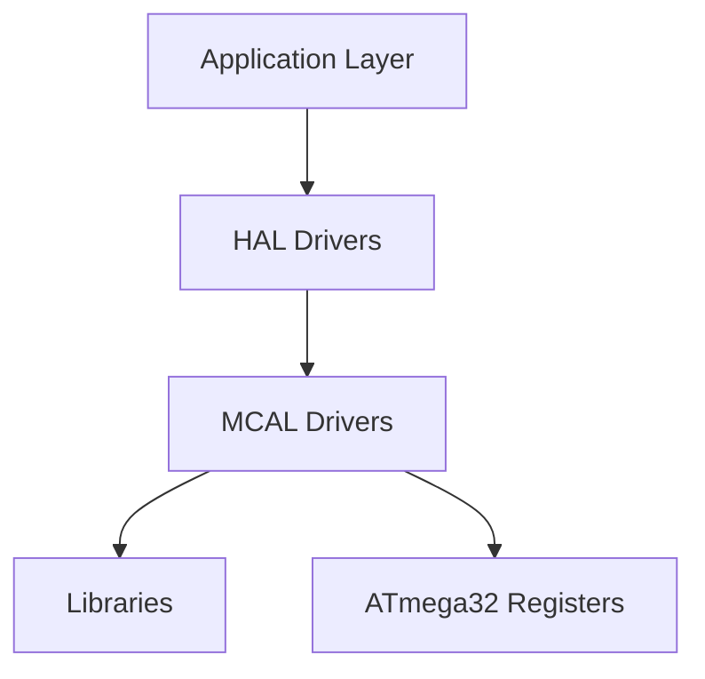
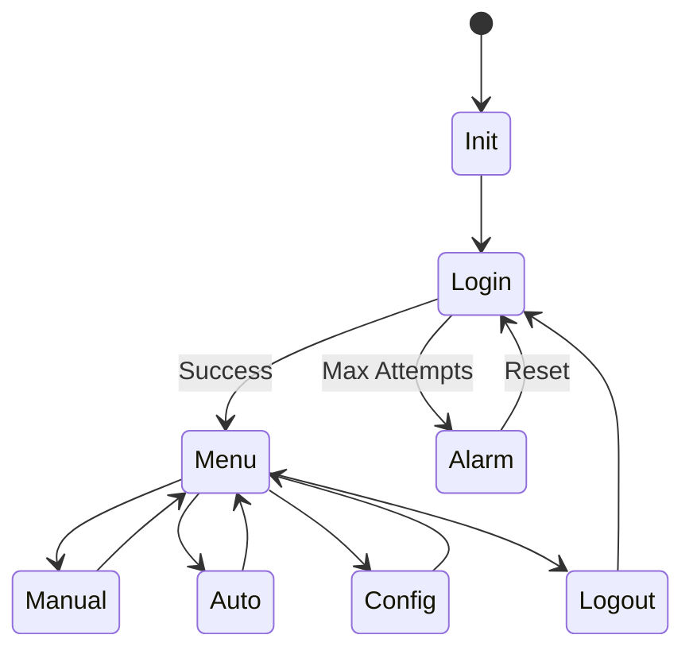
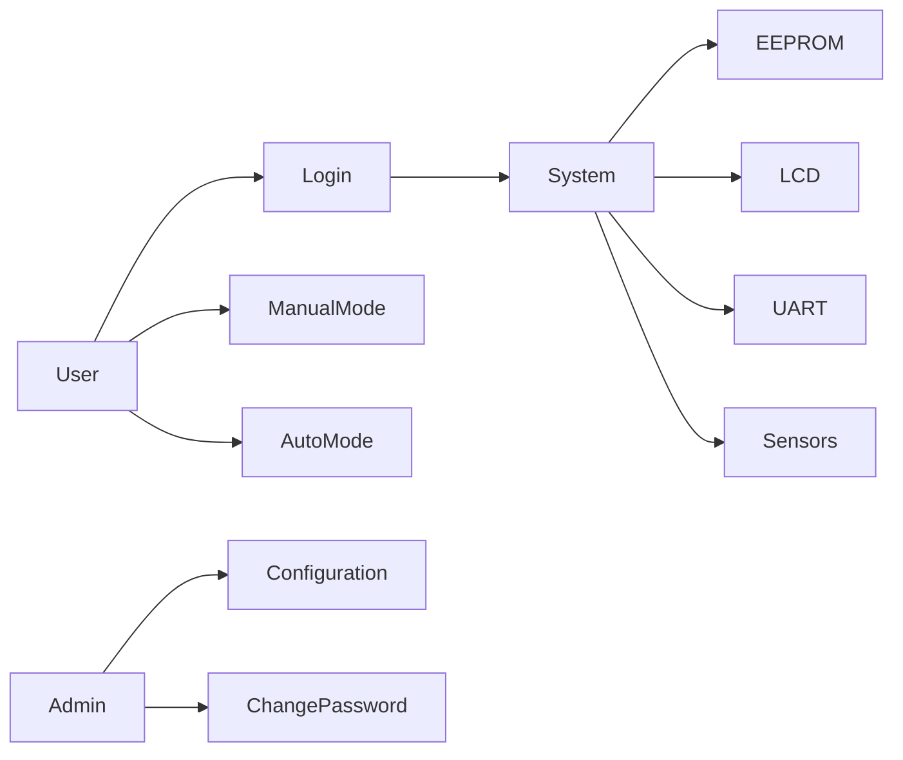
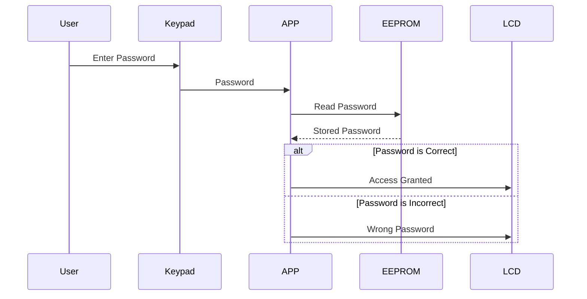
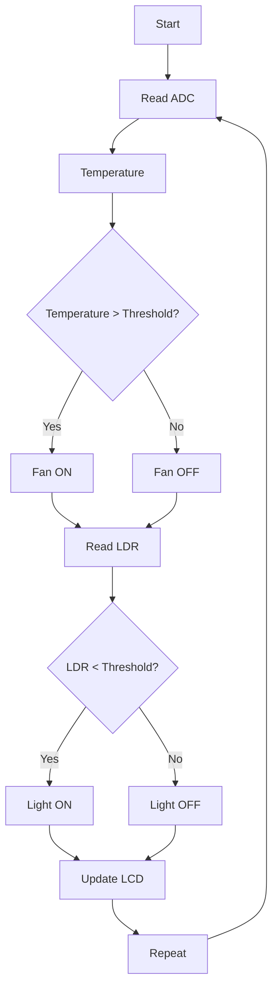
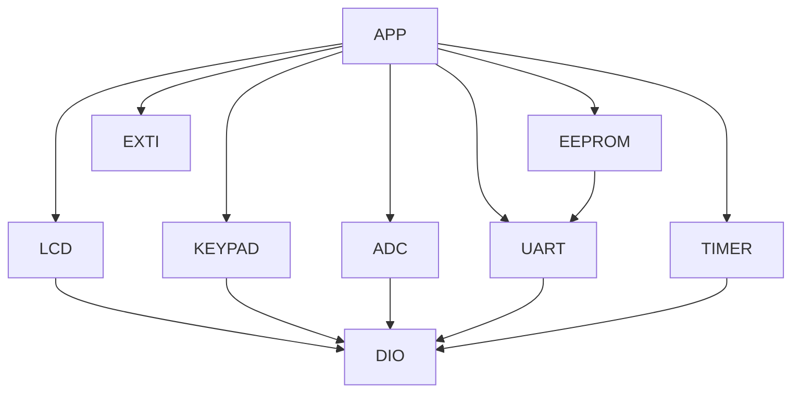
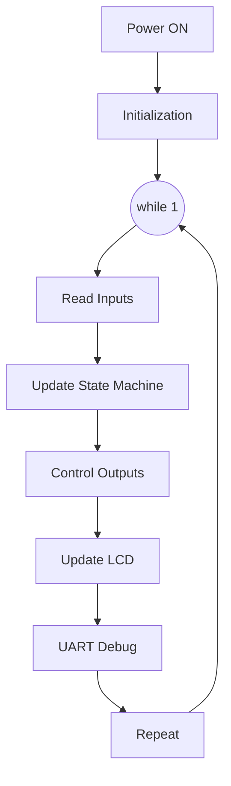
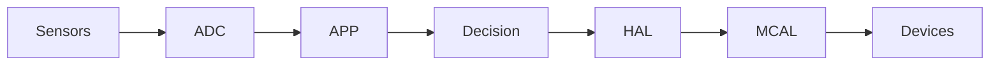

# 🏠 Smart Home Controller

### AVR Embedded Systems Graduation Project

---

<p align="center">

**ATmega32 | Embedded C | Layered Architecture | State Machine | Driver Development**

</p>

---

# Table of Contents

* Project Overview
* Objectives
* Features
* Functional Requirements
* Non-Functional Requirements
* System Architecture
* Software Layers
* Hardware Components
* Folder Structure
* State Machine
* Use Case Diagram
* Login Sequence Diagram
* Automatic Mode Flow
* EEPROM Memory Layout
* Driver Dependency Graph
* Main Scheduler
* Data Flow
* Peripherals Used
* Build Instructions
* Testing
* Future Improvements
* Contributors

---

# Project Overview

The Smart Home Controller is a complete embedded system built around the **ATmega32 AVR Microcontroller**.

The project simulates a real smart home environment where users can authenticate themselves, monitor sensors, control devices, configure system settings, and store persistent data inside EEPROM.

The software follows a **Layered Architecture** with reusable drivers and a centralized application state machine.

---

# Project Objectives

* Apply Embedded C concepts.
* Develop reusable MCAL drivers.
* Design reusable HAL modules.
* Integrate multiple peripherals.
* Implement State Machine architecture.
* Apply Modular Programming.
* Develop real-time applications.
* Practice debugging techniques.
* Follow Embedded Software Design principles.

---

# Functional Requirements

## Authentication

* Password protected system
* Maximum login attempts
* EEPROM password storage
* Administrator access

---

## Manual Mode

User controls

* Room Light
* Fan
* Door Lock
* Alarm

---

## Automatic Mode

The controller automatically controls devices according to sensor values.

Example

Temperature

```
Temperature > Threshold
        ↓
      Fan ON
```

Light Sensor

```
LDR < Threshold
      ↓
   Light ON
```

---

## Configuration

Administrator can modify

* Password
* Temperature Threshold
* Light Threshold
* Alarm Enable
* Operating Mode

---

## Alarm System

Alarm activates when

* Fire detected
* Wrong password
* External emergency interrupt

---

## Event Logging

Store

* Login Success
* Login Failure
* Alarm Events
* Configuration Changes
* Device Operations

inside EEPROM.

---

## UART Debugging

Transmit

* Sensor Readings
* Current State
* Device Status
* Error Messages

to PC.

---

# Non Functional Requirements

* Modular Design
* Layered Architecture
* Code Reusability
* Low RAM Consumption
* Fast Response
* Interrupt Driven
* Easy Maintenance
* Portable Drivers
* Scalable Design
* Hardware Independent HAL

---

# Hardware Components

| Component      | Purpose            |
| -------------- | ------------------ |
| ATmega32       | Main Controller    |
| LCD 16x2       | Display            |
| Keypad         | User Input         |
| LEDs           | Lighting           |
| Relay          | Load Control       |
| LM35           | Temperature        |
| LDR            | Light Sensor       |
| Buzzer         | Alarm              |
| Push Button    | External Interrupt |
| AT24Cxx EEPROM | Data Storage       |
| CH340          | UART Communication |

---

# Software Layers

```text
APP

↓

HAL

↓

MCAL

↓

LIB

↓

ATmega32 Registers
```

---

# Layer Architecture



---

# Folder Structure

```text
SmartHome

├── APP
│
├── HAL
│   ├── LCD
│   ├── KEYPAD
│   ├── LED
│   ├── BUZZER
│   ├── SENSOR
│
├── MCAL
│   ├── DIO
│   ├── ADC
│   ├── UART
│   ├── TIMER
│   ├── EEPROM
│   ├── EXTI
│
├── LIB
│
├── CONFIG
│
├── DOCS
│
└── README.md
```

---

# State Machine



---

# Use Case Diagram



---

# Login Sequence



---

# Automatic Mode Flow



---

# EEPROM Memory Layout

```text
Address

0x00 Password

0x10 Temperature Threshold

0x20 LDR Threshold

0x30 Alarm Enable

0x40 Last Mode

0x50 Event Log
```

---

# Driver Dependency Graph



---

# Main Scheduler



---

# Data Flow



---

# Drivers

| Driver | Status |
| ------ | ------ |
| DIO    | ✅      |
| LCD    | ✅      |
| Keypad | ✅      |
| ADC    | ✅      |
| Timer  | ✅      |
| EXTI   | ✅      |
| UART   | ✅      |
| EEPROM | ✅      |

---

# Build Instructions

1. Open Microchip Studio.
2. Import the project.
3. Select ATmega32.
4. Build the project.
5. Generate HEX file.
6. Load HEX into Proteus.
7. Run simulation.

---

# Testing Checklist

* Login
* Wrong Password
* Manual Mode
* Automatic Mode
* LCD Display
* Sensor Reading
* EEPROM Save
* UART Debug
* Alarm Trigger
* Interrupt Handling

---

# Future Improvements

* ESP8266 WiFi
* Bluetooth HC-05
* GSM Notifications
* Mobile Application
* FreeRTOS
* OTA Updates
* MQTT Protocol
* Cloud Dashboard

---

# Technologies

* Embedded C
* AVR-GCC
* ATmega32
* Microchip Studio
* Proteus
* Git
* GitHub

---

# Learning Outcomes

* Embedded C Programming
* Driver Development
* Layered Architecture
* State Machines
* Register-Level Programming
* Interrupt Handling
* Timer Applications
* UART Communication
* EEPROM Management
* ADC Programming
* Modular Software Design

---

# Team

| Role        | Name                  |
| ----------- | --------------------- |
| Team Leader | **Eng. Hesham Ahmed** |
| Team Member | **Ali Ahmed Elnagar** |
| Team Member | **Marwan Habib**      |
| Team Member | **Loay Hazem**        |

---

# Organization

This project was developed as part of the **National Telecommunication Institute (NTI)** Embedded Systems Training Program.

Special thanks to **Gestell** for supporting the training and project development.

---

# License

This project is released under the **MIT License**.

You are free to use, modify, and distribute this software in accordance with the terms of the MIT License.

For more information, see the `LICENSE` file included in this repository.

---

# Acknowledgments

We would like to express our sincere gratitude to:

* **National Telecommunication Institute (NTI)** for providing the Embedded Systems training program.
* **Gestell** for their technical support and learning resources.
* **Eng. Hesham Ahmed** for his continuous guidance, mentorship, and technical support throughout the project.

---

<p align="center">

**Smart Home Controller**
Embedded Systems Graduation Project using **ATmega32 AVR Microcontroller**

Made with ❤️ by the Smart Home Team.

</p>
