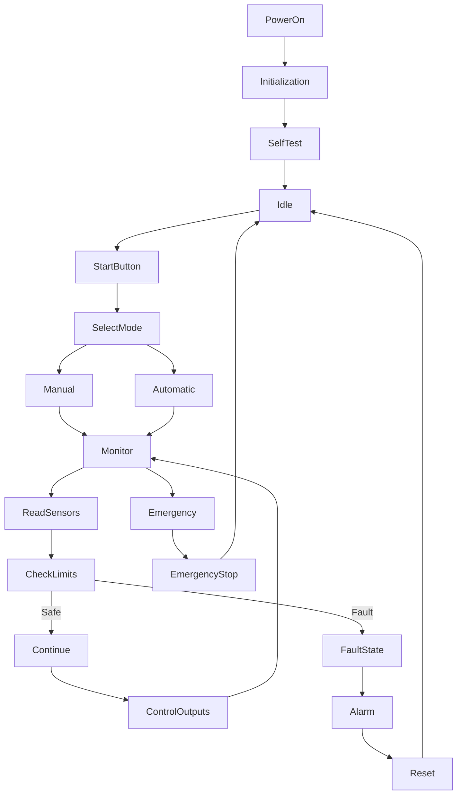
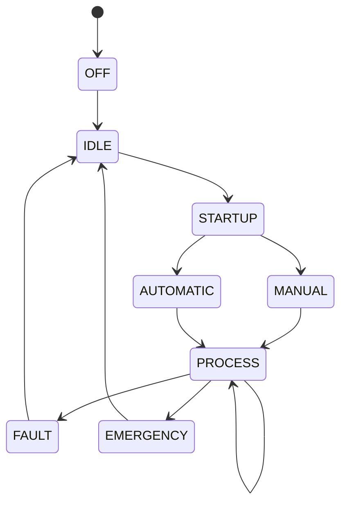
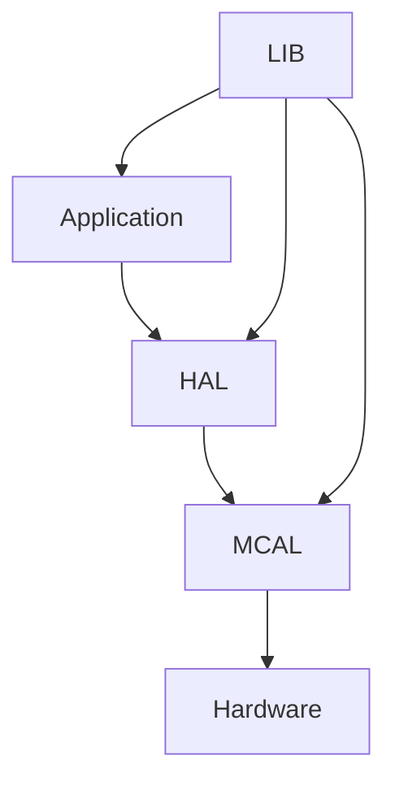
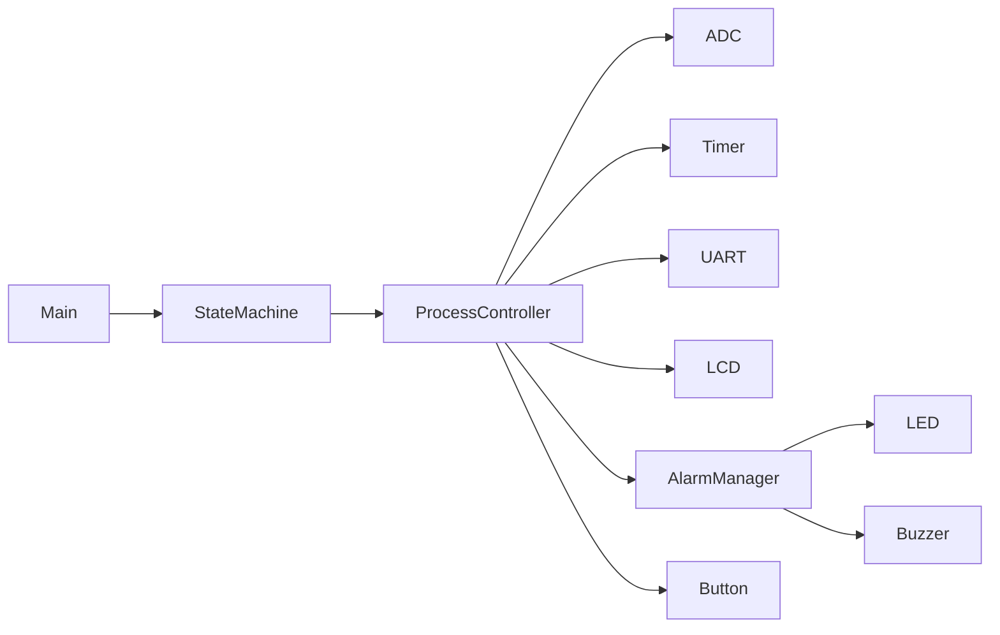

# 🏭 Industrial Process Controller
### Embedded Systems Final Project

An embedded industrial process controller developed using the **ATmega32 AVR Microcontroller** to supervise and control a production process through multiple operating modes while ensuring safe operation, fault handling, operator interaction, and real-time monitoring.

This project demonstrates industrial automation concepts including state machines, process control, fault management, real-time scheduling, and modular embedded software architecture.

---

# 📌 Project Overview

Industrial production systems require controllers capable of monitoring sensors, controlling actuators, responding to operator commands, and ensuring safe system operation.

This project simulates an industrial controller responsible for managing a manufacturing process through different operating states while continuously monitoring process conditions and handling abnormal situations.

The controller integrates multiple embedded peripherals to provide a reliable and safe automation system.

---

# 🎯 Project Objectives

- Control an industrial production process
- Support Manual and Automatic operation
- Monitor analog process variables
- Execute real-time control tasks
- Detect abnormal operating conditions
- Handle emergency situations safely
- Provide operator interaction
- Report system events through UART
- Apply modular layered software architecture

---

# 📋 Functional Requirements

## Start / Stop Operations

The operator shall be able to:

- Start the production process
- Stop the production process
- Restart after normal shutdown
- Resume operation after faults (when allowed)

---

## Manual Mode

In Manual Mode the operator directly controls:

- Motor
- Conveyor
- Pump
- Cooling Fan
- Process Outputs

Safety checks remain active during manual operation.

---

## Automatic Mode

The controller automatically:

- Starts production sequence
- Reads sensors
- Controls outputs
- Executes timing operations
- Adjusts actuators
- Monitors operating conditions
- Handles process transitions

No operator intervention is required during normal operation.

---

## Emergency Stop

Emergency Stop has the highest priority.

When activated:

- Immediately stop all outputs
- Disable actuators
- Activate alarm
- Display emergency state
- Wait for operator reset

---

## Alarm Management

The controller activates alarms when:

- Temperature exceeds limit
- Sensor failure
- Emergency Stop activated
- Invalid operating condition
- Process timeout

Alarm indications:

- Warning LED
- Red Alarm LED
- Buzzer
- UART Message

---

## Process Monitoring

Continuously monitor:

- Temperature
- Process Level
- System Voltage
- Running Time
- Process Status

---

## Operator Interface

Operator controls include:

- Start Button
- Stop Button
- Emergency Button
- Manual / Auto Selector

Status displayed using:

- LCD
- LEDs
- UART Terminal

---

## Fault Recovery

After resolving a fault:

- Verify operating conditions
- Reset alarms
- Return to Idle state
- Allow process restart

---

# 🏭 Operating Modes

The controller supports the following operating modes:

- OFF
- IDLE
- STARTUP
- MANUAL
- AUTOMATIC
- PROCESS RUNNING
- FAULT
- EMERGENCY STOP

---

# ⚠ Fault Detection

The system continuously checks for:

- Over Temperature
- Sensor Failure
- Process Timeout
- Invalid ADC Reading
- Emergency Stop
- Communication Failure

Each detected fault generates:

- Alarm
- UART Report
- Fault Code
- Safe Shutdown

---

# 📡 Event Reporting

UART messages include:

```
SYSTEM READY

PROCESS STARTED

PROCESS STOPPED

AUTO MODE

MANUAL MODE

FAULT DETECTED

EMERGENCY STOP

SYSTEM RESET
```

---

# 🛠 Hardware Requirements

- ATmega32
- 16x2 LCD
- Push Buttons
- Potentiometer
- LM35 Temperature Sensor
- LEDs
- Buzzer
- UART (CH340)
- Relay / Motor Simulation

---

# 💻 Software Requirements

- Microchip Studio
- Proteus
- AVR-GCC
- Git
- GitHub

---

# 📚 Drivers Used

## MCAL

- DIO
- ADC
- UART
- TIMER0
- EXTI

---

## HAL

- LCD
- Buttons
- LEDs
- Buzzer
- Temperature Sensor

---

## LIB

- STD_TYPES
- BIT_MATH
- Common Macros

---

# 📂 Project Structure

```
Industrial_Process_Controller/
│
├── APP
│      main.c
│      Process_Controller.c
│      StateMachine.c
│
├── HAL
│      LCD
│      LED
│      Button
│      Sensor
│      Buzzer
│
├── MCAL
│      DIO
│      ADC
│      UART
│      TIMER
│      EXTI
│
├── LIB
│      STD_TYPES.h
│      BIT_MATH.h
│
└── README.md
```

---

# 🔄 Process Flow



---

# 🧠 State Machine



---

# 🏗 Layered Architecture



---

# 📊 Software Modules



---

# 📈 Real-Time Tasks

| Task | Period |
|-------|---------|
| Read Sensors | 100 ms |
| Update LCD | 250 ms |
| Check Faults | 100 ms |
| UART Report | 1 sec |
| Alarm Handler | Event Driven |

---

# 🚨 Fault Codes

| Code | Description |
|------|-------------|
| P001 | High Temperature |
| P002 | Sensor Failure |
| P003 | Process Timeout |
| P004 | Emergency Stop |
| P005 | Communication Error |

---

# 🚀 Future Improvements

- PID Controller
- Pressure Sensor
- Flow Sensor
- EEPROM Data Logging
- RTC Integration
- SD Card Logging
- Wireless Monitoring
- CAN Bus
- Modbus RTU
- SCADA Interface
- PLC Integration

---

# 📖 Course Information

Embedded Systems Diploma

Topics Covered

- Embedded C
- AVR Architecture
- DIO
- ADC
- Timers
- UART
- Interrupts
- State Machine
- Fault Handling
- Real-Time Control
- Driver Development

---

# 👥 Team

| Name |
|------|
|Kerillos youssef zekry |
|Amr nady mokhtar |
|Ahmed hossam  |

---

# 👨‍💼 Team Leader

**Eng. Hesham Ahmed**

---

# 📜 License

This project was developed during the **NTI Embedded Systems Training Program**.

Licensed under the **MIT License**.

Project Organization: **Gestell**

---

# 🙏 Acknowledgment

Special thanks to:

- National Telecommunication Institute (NTI)
- Eng. Hesham Ahmed
- Gestell Team

for their guidance and support throughout this project.

---

# ⭐ Final Note

The Industrial Process Controller demonstrates the fundamentals of industrial automation by combining real-time monitoring, process control, state-machine design, fault management, and layered embedded software architecture into a modular and scalable embedded application.