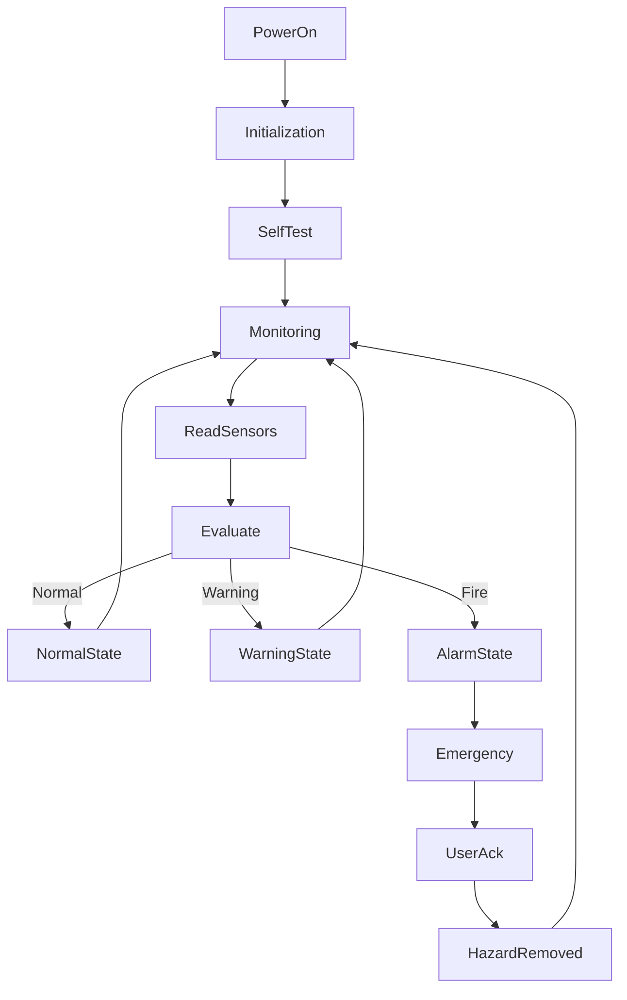
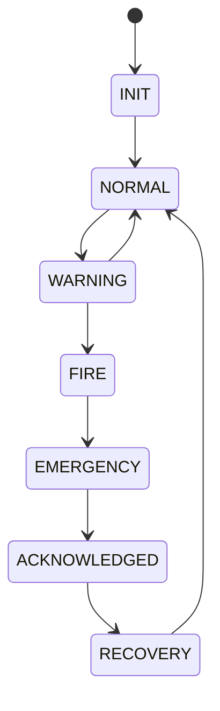
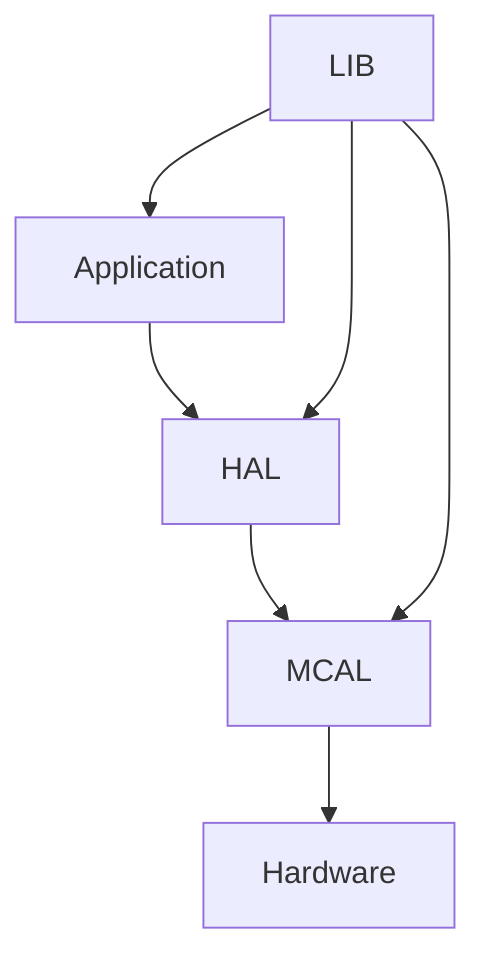
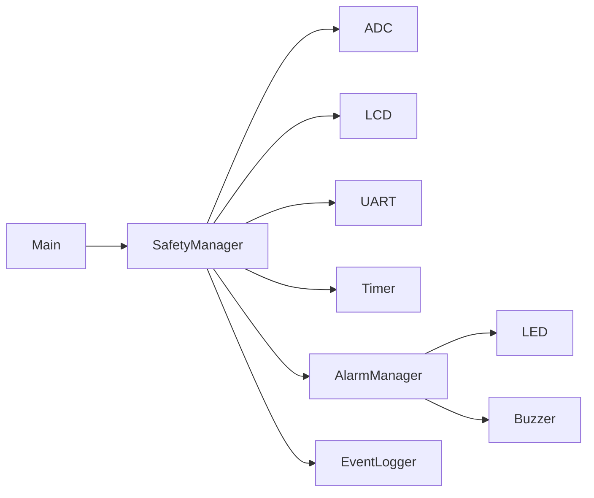

# 🔥 Fire Detection & Safety System
### Embedded Systems Final Project

A safety-critical embedded system built using the **ATmega32 AVR Microcontroller** that continuously monitors environmental conditions, detects potential fire hazards, evaluates risk levels, and performs appropriate protection procedures while keeping operators informed through visual, audible, and serial interfaces.

This project demonstrates real-time monitoring, safety logic, state-machine design, alarm management, and event logging commonly found in industrial and commercial fire protection systems.

---

# 📌 Project Overview

Fire detection systems are essential safety solutions used in buildings, factories, laboratories, and warehouses.

The controller continuously acquires data from environmental sensors, analyzes potential hazards, classifies warning levels, activates alarms when necessary, and maintains system safety through predefined protection procedures.

The system is designed with reliability and fast response as the highest priorities.

---

# 🎯 Project Objectives

- Continuously monitor environmental conditions
- Detect possible fire hazards
- Classify warning severity
- Trigger alarms automatically
- Display system status
- Allow user acknowledgment
- Log important events
- Support serial diagnostics
- Implement reliable safety logic
- Build a modular embedded software architecture

---

# 📋 Functional Requirements

## Continuous Monitoring

The controller continuously monitors:

- Temperature
- Smoke Level (Simulated)
- Flame Detection (Optional)
- System Health
- Sensor Availability

Sensor readings are periodically sampled using ADC.

---

## Event Detection

The system detects events including:

- High Temperature
- Smoke Detected
- Flame Detected
- Sensor Failure
- Communication Failure

Each event is classified according to its severity.

---

## Warning Levels

### 🟢 Normal

- Green LED ON
- No alarm
- Continue monitoring

---

### 🟡 Warning

Activated when:

- Temperature approaches threshold
- Slight smoke detected

Actions:

- Yellow LED
- LCD Warning Message
- UART Notification

---

### 🔴 Fire Alarm

Activated when:

- Temperature exceeds limit
- Heavy smoke detected
- Flame detected

Actions:

- Red LED
- Buzzer
- LCD Alarm Message
- UART Alarm Report

---

### ⚫ Emergency

Critical state requiring immediate action.

Actions:

- Continuous alarm
- Flashing indicators
- Emergency UART message
- System remains locked until acknowledgment

---

## Alarm Management

Alarm outputs include:

- Buzzer
- Red LED
- LCD Notification
- UART Report

Alarm continues until:

- Hazard removed
- User acknowledges alarm

---

## User Acknowledgment

Operator can:

- Silence buzzer
- Acknowledge alarm
- View active warnings
- Reset system after hazard removal

Safety conditions must be verified before reset.

---

## System Status Display

LCD displays:

- Current Temperature
- Smoke Level
- Warning Level
- System Status
- Alarm Status

Example:

```

Temp : 34 C
Smoke: LOW
Status: NORMAL

```

---

## Event Logging

UART records important system events.

Example

```

SYSTEM STARTED

WARNING LEVEL 1

SMOKE DETECTED

FIRE ALARM

USER ACKNOWLEDGED

SYSTEM RESET

```

---

# 🚨 Emergency States

The controller operates through the following safety states:

- Power On
- Initialization
- Monitoring
- Warning
- Fire Alarm
- Emergency
- Recovery

---

# 🛠 Hardware Requirements

- ATmega32
- LM35 Temperature Sensor
- Smoke Sensor (MQ-2 Simulation)
- Flame Sensor (Optional)
- 16x2 LCD
- LEDs
- Buzzer
- Push Button
- UART (CH340)

---

# 💻 Software Requirements

- Microchip Studio
- Proteus
- AVR-GCC
- Git
- GitHub

---

# 📚 Drivers Used

## MCAL

- ADC
- DIO
- UART
- TIMER0
- EXTI

---

## HAL

- LCD
- Temperature Sensor
- Smoke Sensor
- LEDs
- Buzzer
- Push Button

---

## LIB

- STD_TYPES
- BIT_MATH
- Common Macros

---

# 📂 Project Structure

```

Fire_Detection_System/
│
├── APP
│      main.c
│      Fire_Controller.c
│      Safety_Manager.c
│
├── HAL
│      LCD
│      LM35
│      MQ2
│      LED
│      Buzzer
│      Button
│
├── MCAL
│      ADC
│      DIO
│      UART
│      TIMER
│      EXTI
│
├── LIB
│      STD_TYPES.h
│      BIT_MATH.h
│
└── README.md

```

---

# 🔄 System Flow



---

# 🧠 Safety State Machine



---

# 🏗 Layered Architecture



---

# 📊 Software Modules



---

# 📈 Monitoring Schedule

| Task | Period |
|-------|---------|
| Read Temperature | 100 ms |
| Read Smoke Sensor | 100 ms |
| Update LCD | 250 ms |
| Safety Evaluation | 100 ms |
| UART Logging | 1 sec |
| Alarm Update | Event Driven |

---

# 🚨 Alarm Levels

| Level | Description |
|--------|-------------|
| Level 0 | Normal |
| Level 1 | Warning |
| Level 2 | Fire Detected |
| Level 3 | Emergency |

---

# 🚀 Future Improvements

- Gas Leakage Detection
- Multiple Fire Zones
- GSM SMS Alerts
- Wi-Fi Monitoring
- Mobile Application
- Battery Backup
- SD Card Event Logging
- IoT Cloud Dashboard
- CO Sensor Integration
- Automatic Sprinkler Control

---

# 📖 Course Information

Embedded Systems Diploma

Topics Covered

- Embedded C
- AVR Architecture
- ADC
- LCD
- UART
- Timers
- Interrupts
- State Machine
- Safety Logic
- Driver Development

---

# 👥 Team

### 🔥 Resistors on Fire

| Name |
|------|
| Beshoy Esmat Alfons |
| Yousef Medhat Abdel Hakem |
| Ali Mohamed Farok |
| Rohayem Moataz Mahfouz |
| Moaz Ahmed Abdel Ady |

---

# 👨‍💼 Team Leader

**Eng. Hesham Ahmed**

---

# 📜 License

This project was developed during the **NTI Embedded Systems Training Program**.

Licensed under the **MIT License**.

Project Organization: **Gestell**

---

# 🙏 Acknowledgment

Special thanks to:

- National Telecommunication Institute (NTI)
- Eng. Hesham Ahmed
- Gestell Team

for their support and guidance throughout this project.

---

# ⭐ Final Note

The Fire Detection & Safety System demonstrates the principles of safety-critical embedded software by integrating continuous environmental monitoring, real-time event detection, alarm management, user interaction, and layered software architecture into a reliable and scalable fire protection solution.