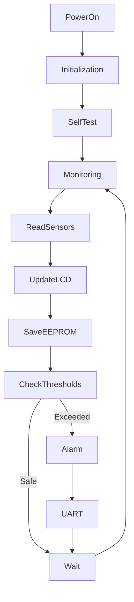
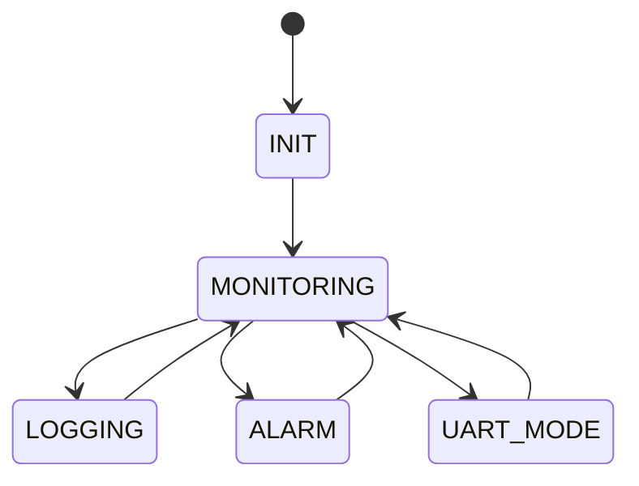
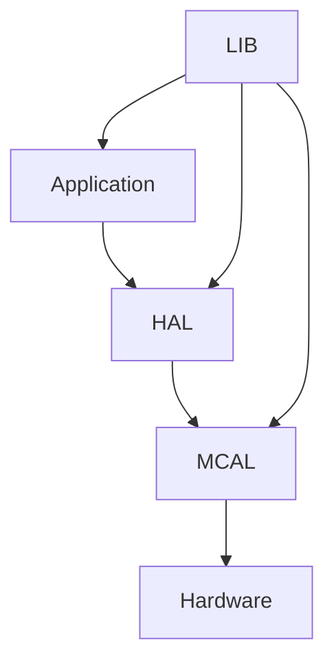
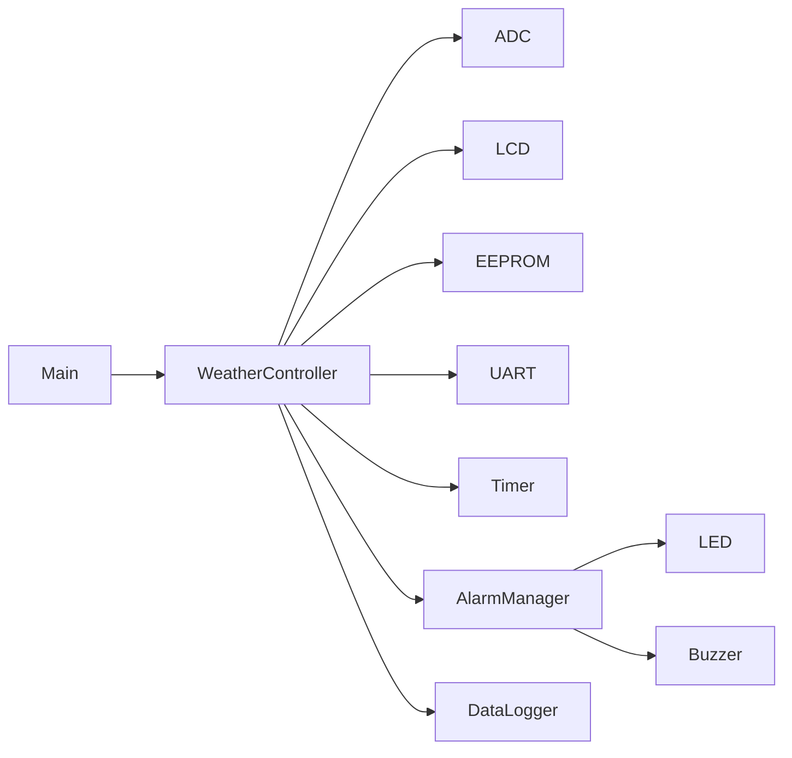

# 🌦️ Weather Monitoring & Data Logging Station
### Embedded Systems Final Project

A real-time environmental monitoring station built using the **ATmega32 AVR Microcontroller** that continuously acquires environmental data, displays live measurements, stores historical records in EEPROM, and communicates with a PC for data retrieval and system diagnostics.

This project demonstrates real-time data acquisition, embedded data logging, threshold monitoring, serial communication, and modular embedded software architecture.

---

# 📌 Project Overview

Environmental monitoring systems are widely used in agriculture, weather stations, greenhouses, laboratories, warehouses, and smart buildings.

This project simulates a compact weather monitoring station capable of continuously collecting sensor measurements, displaying live information, storing historical data, generating alarms when environmental limits are exceeded, and allowing users to retrieve logged data through a serial interface.

---

# 🎯 Project Objectives

- Continuously monitor environmental conditions
- Display real-time sensor values
- Store historical measurements in EEPROM
- Generate threshold-based alarms
- Support serial communication with a PC
- Implement periodic sampling using timers
- Build reusable embedded drivers
- Apply layered software architecture

---

# 📋 Functional Requirements

## Real-Time Sensor Reading

The controller continuously samples environmental sensors including:

- Temperature Sensor (LM35)
- Light Sensor (LDR)
- Supply Voltage (Optional)

Sensor acquisition is performed periodically using the ADC.

---

## Local Status Display

The LCD continuously displays:

- Current Temperature
- Light Intensity
- System Status
- Alarm Status
- Logging Status

Example

```
Temp : 28°C
Light: 72%
Status: NORMAL
```

---

## Data Logging

The controller periodically stores measurements inside EEPROM.

Each record contains:

- Sample Number
- Temperature
- Light Level
- Alarm Status

Measurements are saved at fixed time intervals.

---

## Data Retrieval

Stored records can be retrieved through UART.

Available commands include:

```
READ LOG

CLEAR LOG

CURRENT DATA

SYSTEM STATUS

HELP
```

Example Output

```
Record 15

Temperature : 29°C

Light : 68%

Status : NORMAL
```

---

## Threshold Alarm

The controller compares sensor values against predefined thresholds.

Temperature Alarm

- High Temperature
- Low Temperature (Optional)

Light Alarm

- Very Low Light
- Very High Light

When limits are exceeded:

- Alarm LED ON
- Buzzer Activated
- LCD Warning
- UART Notification

---

## System Monitoring

Continuously monitor:

- Temperature
- Light Intensity
- EEPROM Status
- UART Communication
- Sensor Availability

---

## Event Logging

Important events are stored and reported.

Examples:

```
SYSTEM STARTED

LOG SAVED

HIGH TEMPERATURE

LOW LIGHT

EEPROM FULL

DATA CLEARED
```

---

# 🛠 Hardware Requirements

- ATmega32
- LM35 Temperature Sensor
- LDR Sensor
- 16x2 LCD
- EEPROM (Internal / External)
- LEDs
- Buzzer
- UART (CH340)

---

# 💻 Software Requirements

- Microchip Studio
- Proteus
- AVR-GCC
- Git
- GitHub

---

# 📚 Drivers Used

## MCAL

- ADC
- DIO
- UART
- TIMER0
- EXTI

---

## HAL

- LCD
- LM35
- LDR
- EEPROM
- LEDs
- Buzzer

---

## LIB

- STD_TYPES
- BIT_MATH
- Common Macros

---

# 📂 Project Structure

```
Weather_Station/
│
├── APP
│      main.c
│      Weather_Controller.c
│      DataLogger.c
│
├── HAL
│      LCD
│      LM35
│      LDR
│      EEPROM
│      LED
│      Buzzer
│
├── MCAL
│      ADC
│      DIO
│      UART
│      TIMER
│      EXTI
│
├── LIB
│      STD_TYPES.h
│      BIT_MATH.h
│
└── README.md
```

---

# 🌦️ System Flow



---

# 🧠 State Machine



---

# 🏗 Layered Architecture



---

# 📊 Software Modules



---

# 📈 Sampling Schedule

| Task | Period |
|-------|---------|
| Read Temperature | 500 ms |
| Read Light Sensor | 500 ms |
| Update LCD | 1 sec |
| Save Data | 5 sec |
| Check Alarm | 500 ms |
| UART Communication | Event Driven |

---

# 💾 EEPROM Memory Layout

| Address | Stored Data |
|----------|-------------|
| 0x000 | Record Counter |
| 0x010 | Record 1 |
| 0x020 | Record 2 |
| 0x030 | Record 3 |
| ... | ... |

---

# 🚨 Alarm Conditions

| Alarm | Condition |
|---------|-----------|
| High Temperature | Temp > Threshold |
| Low Light | Light < Threshold |
| High Light | Light > Threshold |
| EEPROM Full | No Free Memory |
| Sensor Failure | Invalid ADC Reading |

---

# 🚀 Future Improvements

- Humidity Sensor (DHT11/DHT22)
- Atmospheric Pressure Sensor
- RTC Time Stamping
- SD Card Data Logging
- Wi-Fi Connectivity
- IoT Cloud Dashboard
- Bluetooth Monitoring
- Mobile Application
- Solar Power Support
- Weather Trend Analysis

---

# 📖 Course Information

Embedded Systems Diploma

Topics Covered

- Embedded C
- AVR Architecture
- ADC
- LCD
- EEPROM
- UART
- Timers
- Interrupts
- State Machine
- Driver Development

---

# 👥 Team

| Name |
|------|
|Ali Mohamed Ramadan Elsotohy| 
|Seif Alaa Abd El Fattah| 
|ahmed sobhy mohammed |
|Ahmed Ayman Fekry |
---

# 👨‍💼 Team Leader

**Eng. Hesham Ahmed**

---

# 📜 License

This project was developed during the **NTI Embedded Systems Training Program**.

Licensed under the **MIT License**.

Project Organization: **Gestell**

---

# 🙏 Acknowledgment

Special thanks to:

- National Telecommunication Institute (NTI)
- Eng. Hesham Ahmed
- Gestell Team

for their guidance and continuous support throughout this project.

---

# ⭐ Final Note

The Weather Monitoring & Data Logging Station demonstrates the core principles of embedded environmental monitoring by integrating real-time sensing, historical data storage, alarm generation, and serial communication into a modular and scalable embedded system suitable for weather stations, smart agriculture, and industrial monitoring applications.