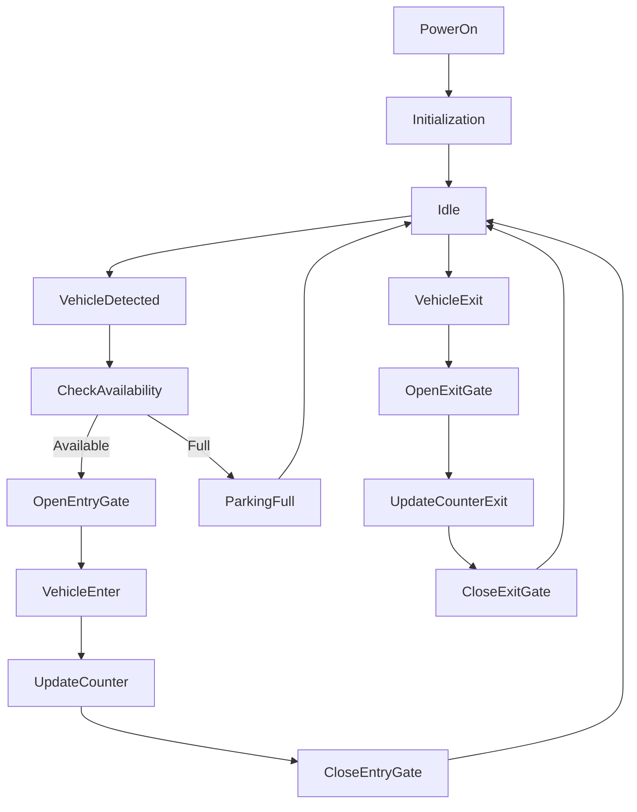
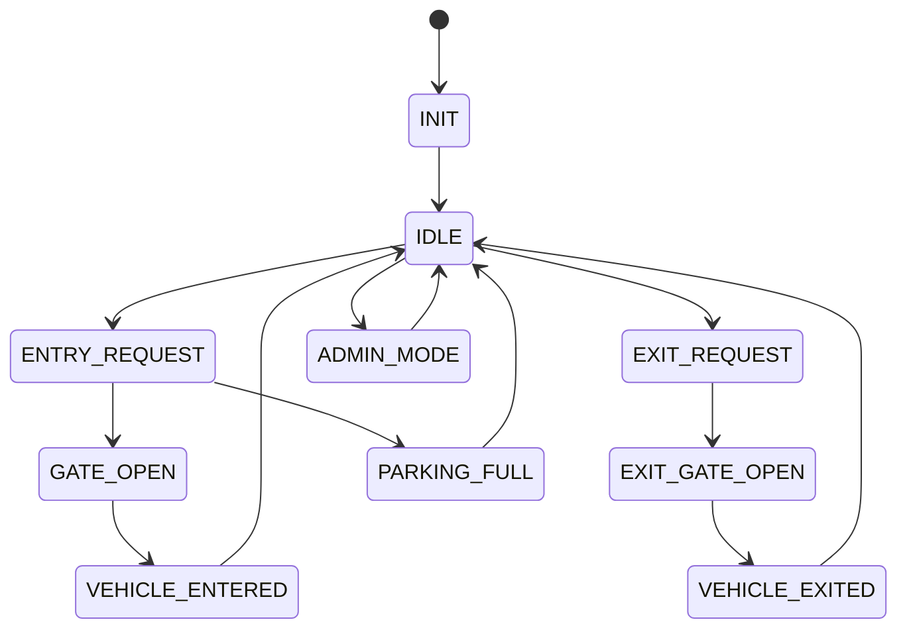
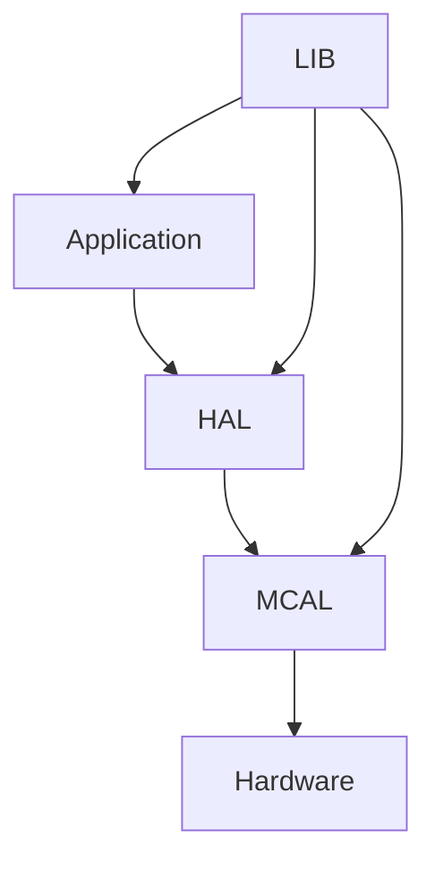
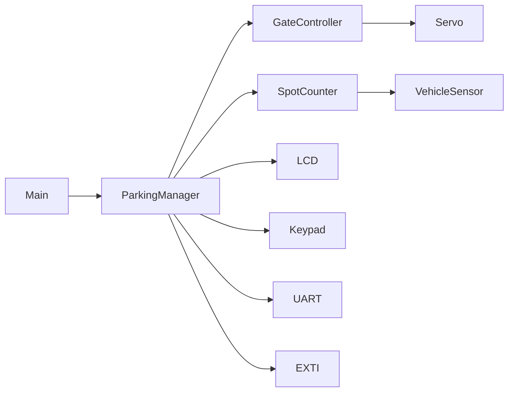

# 🅿️ Automated Parking Lot System
### Embedded Systems Final Project

An embedded smart parking management system built using the **ATmega32 AVR Microcontroller** to automate vehicle entry and exit, monitor parking availability, control gate access, and provide real-time parking information through an intuitive operator interface.

The project demonstrates real-time control, state machine implementation, PWM-based servo control, external interrupt handling, and modular embedded software architecture.

---

# 📌 Project Overview

Smart parking systems improve traffic flow, reduce waiting time, and efficiently utilize parking spaces.

This project simulates an automated parking lot controller capable of detecting vehicle movement, managing entry and exit gates, tracking available parking spaces, displaying occupancy status, and allowing administrators to manually control the system when required.

---

# 🎯 Project Objectives

- Automate vehicle entry and exit
- Control parking gates using Servo Motor (PWM)
- Count occupied and available parking spaces
- Display parking status on LCD
- Prevent entry when parking is full
- Support administrator override mode
- Handle external events using interrupts
- Implement reliable State Machine architecture
- Build reusable embedded drivers

---

# 📋 Functional Requirements

## Vehicle Entry Detection

The system detects an arriving vehicle using an external sensor or push button.

If parking spaces are available:

- Open entry gate
- Increment occupied spaces
- Decrease available spaces
- Update LCD

If parking is full:

- Keep gate closed
- Display **Parking Full**
- Activate warning indicator

---

## Vehicle Exit Detection

When a vehicle leaves:

- Detect exit event
- Open exit gate
- Decrement occupied spaces
- Increase available spaces
- Update LCD

---

## Gate Control

Both entry and exit gates are controlled using a Servo Motor.

Servo Positions:

- Closed → 0°
- Open → 90°

Gate operation includes:

- Open
- Delay
- Close Automatically

---

## Parking Spot Counting

The controller continuously maintains:

- Total Capacity
- Occupied Spaces
- Available Spaces

Example

```
Total : 20
Free  : 12
Busy  : 8
```

---

## Lot Full Lockdown

When all parking spaces are occupied:

- Entry gate remains closed
- "Parking Full" displayed
- Entry requests rejected
- Exit gate remains operational

---

## Administrator Override Mode

Administrator can:

- Open/Close gates manually
- Reset parking counter
- Change parking capacity
- Enable maintenance mode
- Clear system faults

Access is protected using a password entered via Keypad.

---

## System Monitoring

The controller continuously monitors:

- Entry Requests
- Exit Requests
- Parking Capacity
- Gate Position
- System Status

---

## Event Logging

UART reports major events including:

```
SYSTEM READY

VEHICLE ENTERED

VEHICLE EXITED

ENTRY GATE OPENED

EXIT GATE OPENED

PARKING FULL

ADMIN LOGIN

SYSTEM RESET
```

---

# 🛠 Hardware Requirements

- ATmega32
- Servo Motor (Entry Gate)
- Servo Motor (Exit Gate)
- LCD 16x2
- 4x4 Keypad
- IR Sensor / Push Button (Vehicle Detection)
- LEDs
- UART (CH340)

---

# 💻 Software Requirements

- Microchip Studio
- Proteus
- AVR-GCC
- Git
- GitHub

---

# 📚 Drivers Used

## MCAL

- DIO
- TIMER1 (PWM)
- EXTI
- UART

---

## HAL

- LCD
- Keypad
- Servo Motor
- LEDs
- Vehicle Sensors

---

## LIB

- STD_TYPES
- BIT_MATH
- Common Macros

---

# 📂 Project Structure

```
Automated_Parking_System/
│
├── APP
│      main.c
│      Parking_Controller.c
│      Parking_Manager.c
│
├── HAL
│      LCD
│      Keypad
│      Servo
│      Sensor
│      LED
│
├── MCAL
│      DIO
│      TIMER
│      UART
│      EXTI
│
├── LIB
│      STD_TYPES.h
│      BIT_MATH.h
│
└── README.md
```

---

# 🚗 System Flow



---

# 🧠 State Machine



---

# 🏗 Layered Architecture



---

# 📊 Software Modules



---

# 📈 Real-Time Tasks

| Task | Period |
|-------|---------|
| Check Entry Sensor | Event Driven |
| Check Exit Sensor | Event Driven |
| Update LCD | 500 ms |
| Gate Control | On Demand |
| UART Status | 1 sec |

---

# 🚨 System States

| State | Description |
|--------|-------------|
| INIT | Hardware Initialization |
| IDLE | Waiting for Vehicle |
| ENTRY | Processing Vehicle Entry |
| EXIT | Processing Vehicle Exit |
| FULL | Parking Capacity Reached |
| ADMIN | Administrator Mode |
| ERROR | Fault Handling |

---

# 🚀 Future Improvements

- RFID Vehicle Authentication
- License Plate Recognition (LPR)
- Mobile Reservation System
- GSM Notifications
- IoT Cloud Dashboard
- Multi-Level Parking Support
- Payment Integration
- Camera Monitoring
- CAN Bus Communication
- Smart City Integration

---

# 📖 Course Information

Embedded Systems Diploma

Topics Covered

- Embedded C
- AVR Architecture
- PWM
- Timers
- DIO
- LCD
- Keypad
- External Interrupts
- UART
- State Machine
- Driver Development

---

# 👥 Team

| Name |
|------|
| Abdulrahman Ali Abdelaziz Ali |
| Yousef Mohamed Al-Sayed Abohashem Hassan |
| Omar Hamdy Hamed Abdelrahman |
| Omar Alaa Eldin Abdelrady |
| Mina Ramy Rizk Youssef |

---

# 👨‍💼 Team Leader

**Eng. Hesham Ahmed**

---

# 📜 License

This project was developed during the **NTI Embedded Systems Training Program**.

Licensed under the **MIT License**.

Project Organization: **Gestell**

---

# 🙏 Acknowledgment

Special thanks to:

- National Telecommunication Institute (NTI)
- Eng. Hesham Ahmed
- Gestell Team

for their guidance and continuous support throughout this project.

---

# ⭐ Final Note

The Automated Parking Lot System demonstrates the fundamentals of smart infrastructure by integrating vehicle detection, gate automation, parking management, operator interaction, and real-time embedded control into a scalable and modular embedded application. The project reflects real-world smart parking solutions used in commercial buildings, shopping malls, airports, and smart city environments.