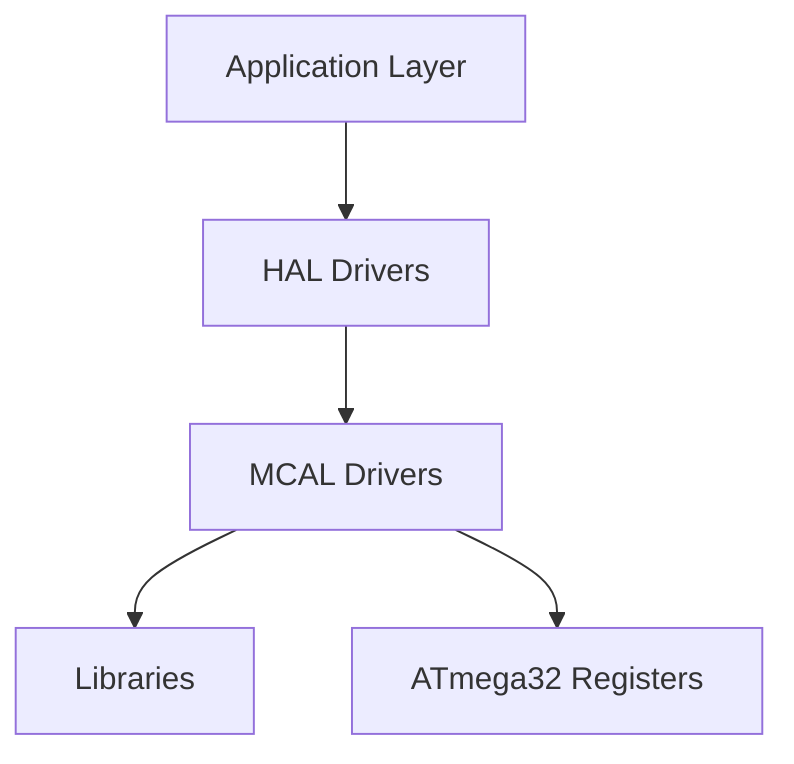
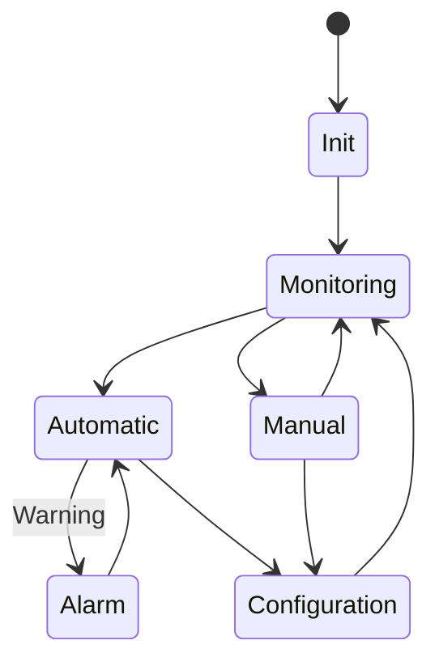
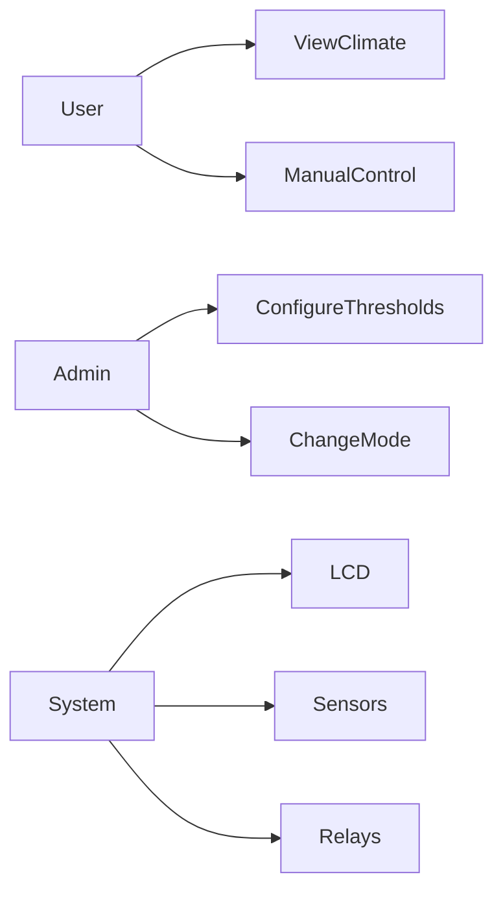
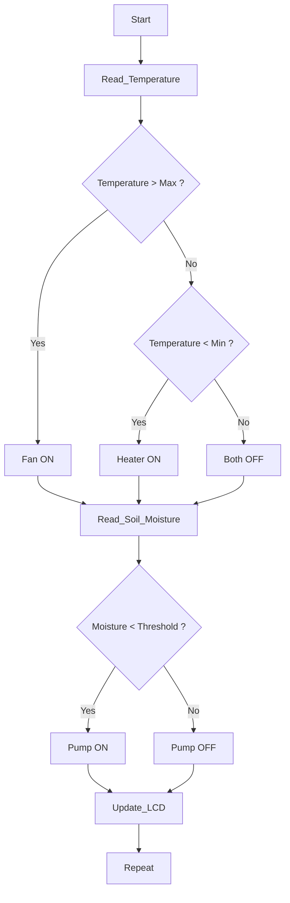
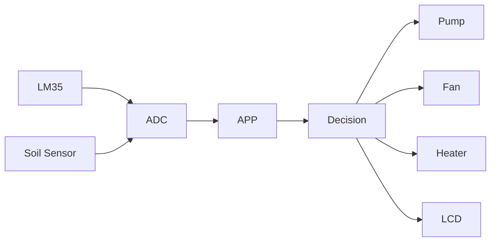
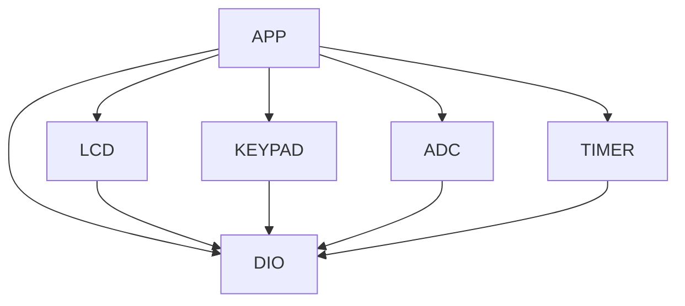

# Greenhouse Climate Control System

**AVR Embedded Systems Final Project**

## 🌱 Project Overview

The Greenhouse Climate Control System is an embedded application developed using the ATmega32 AVR Microcontroller. The system continuously monitors environmental conditions inside a greenhouse, including soil moisture and ambient temperature, and automatically controls actuators such as water pumps, cooling fans, and heaters to maintain optimal growing conditions.

The software follows a Layered Architecture, utilizing reusable MCAL and HAL drivers with a centralized application State Machine for efficient control and easy maintenance.

## 🎯 Project Objectives

- Apply Embedded C programming concepts.
- Develop reusable peripheral drivers.
- Interface analog sensors using ADC.
- Control actuators through digital outputs.
- Design an event-driven State Machine.
- Build an automatic climate control system.
- Implement configurable operating parameters.
- Practice modular software architecture.

## ✨ Features

- 🌡 Temperature Monitoring
- 💧 Soil Moisture Monitoring
- 🚿 Automatic Irrigation
- 🌬 Automatic Fan Control
- 🔥 Heater Control
- 🔄 Auto / Manual Modes
- ⚙ Parameter Configuration
- 🚨 Warning Indicators
- 📟 LCD User Interface
- ⌨ Keypad Navigation
- ⏱ Timer-Based Sampling
- 🧩 Modular Driver Design

## ✅ Functional Requirements

### Climate Monitoring

- Read temperature sensor.
- Read soil moisture sensor.
- Display sensor values on LCD.
- Periodically update readings.

### Automatic Mode

The system shall automatically:

- Turn ON the water pump if soil moisture is below the threshold.
- Turn OFF the pump after reaching the desired moisture level.
- Turn ON the cooling fan if temperature exceeds the configured limit.
- Turn ON the heater when temperature falls below the minimum threshold.
- Ensure fan and heater are never active simultaneously.

### Manual Mode

The user shall be able to:

- Manually control:
  - Water Pump
  - Cooling Fan
  - Heater
- Return to automatic mode at any time.

### Configuration Menu

The administrator/user can configure:

- Maximum Temperature
- Minimum Temperature
- Soil Moisture Threshold
- Sampling Period
- Auto/Manual Mode

### Warning System

The system shall indicate abnormal conditions:

- High Temperature
- Low Temperature
- Dry Soil
- Sensor Failure (Optional)

using LEDs or buzzer.

## 📋 Non-Functional Requirements

- Layered Architecture
- Modular Design
- Code Reusability
- Low RAM Usage
- Fast Response Time
- Easy Maintenance
- Scalable Software
- Portable Drivers
- Hardware Abstraction
- Efficient ADC Sampling

## 🔧 Hardware Components

| Component            | Purpose                 |
| -------------------- | ----------------------- |
| ATmega32             | Main Controller         |
| LCD 16x2             | Display Information     |
| Keypad               | User Interface          |
| LM35                 | Temperature Sensor      |
| Soil Moisture Sensor | Soil Monitoring         |
| Relay Module         | Pump/Fan/Heater Control |
| Water Pump           | Irrigation              |
| Cooling Fan          | Cooling                 |
| Heater               | Heating                 |
| LEDs                 | Warning Indicators      |
| Timer0               | Periodic Sampling       |

## 🏗 Software Layers

```
APP
 ↓
HAL
 ↓
MCAL
 ↓
LIB
 ↓
ATmega32 Registers
```

## 🏛 Layered Architecture



## 📂 Folder Structure

```
Greenhouse
├── APP
│   ├── Main
│   ├── ClimateControl
│   ├── StateMachine
│
├── HAL
│   ├── LCD
│   ├── KEYPAD
│   ├── LM35
│   ├── SOIL_SENSOR
│
├── MCAL
│   ├── ADC
│   ├── DIO
│   ├── TIMER
│
├── LIB
│
├── CONFIG
│
├── DOCS
│
└── README.md
```

## 🔄 System State Machine



## 🎮 Use Case Diagram



## 🌡 Climate Control Logic



## 📊 ADC Data Flow



## 🔗 Driver Dependency Graph



## ⏱ Main Scheduler

```mermaid
flowchart TD
    PowerON --> Init[Initialize Drivers]
    Init --> Loop[while(1)]
    Loop --> Read[Read Sensors]
    Read --> Update[Update State Machine]
    Update --> Control[Control Outputs]
    Control --> Refresh[Refresh LCD]
    Refresh --> Read
```

## 📋 Drivers

| Driver | Status |
| ------ | ------ |
| DIO    | ✅     |
| ADC    | ✅     |
| LCD    | ✅     |
| Keypad | ✅     |
| Timer  | ✅     |

## 🔧 Build Instructions

1. Open Microchip Studio.
2. Select ATmega32.
3. Build the project.
4. Generate the HEX file.
5. Load it into Proteus.
6. Run the simulation.

## ✅ Testing Checklist

- [ ] Temperature Reading
- [ ] Soil Moisture Reading
- [ ] Pump Operation
- [ ] Fan Operation
- [ ] Heater Operation
- [ ] LCD Display
- [ ] Keypad Navigation
- [ ] Manual Mode
- [ ] Automatic Mode
- [ ] Threshold Configuration

## 🚀 Future Improvements

- Humidity Sensor Integration
- Light Intensity Control
- RTC-Based Scheduling
- SD Card Data Logging
- ESP8266 Wi-Fi Monitoring
- Bluetooth Mobile App
- GSM SMS Alerts
- FreeRTOS Migration
- Cloud Dashboard
- MQTT Support

## 💻 Technologies

- Embedded C
- AVR-GCC
- ATmega32
- Microchip Studio
- Proteus
- Git
- GitHub

## 📚 Learning Outcomes

- Embedded C Programming
- ADC Programming
- Sensor Interfacing
- Driver Development
- State Machine Design
- Timer Applications
- Layered Architecture
- Modular Programming
- Digital Output Control

## 👥 Team

| Role        | Name                         |
| ----------- | ---------------------------- |
| Team Leader | Eng. Hesham Ahmed            |
| Team Member | Kareem Atef Mohamed          |
| Team Member | Zeyad Hany Mahmoud           |
| Team Member | Omar Mohamed Mahrous         |

## 🏢 Organization

This project was developed as part of the National Telecommunication Institute (NTI) Embedded Systems Training Program.

Special thanks to Gestell for supporting the training and project development.

## 📄 License

This project is released under the MIT License.

You are free to use, modify, and distribute this software under the terms of the MIT License.

## 🙏 Acknowledgments

Special thanks to:

- National Telecommunication Institute (NTI)
- Gestell
- Eng. Hesham Ahmed

for their guidance, support, and valuable mentorship throughout this Embedded Systems training program.
